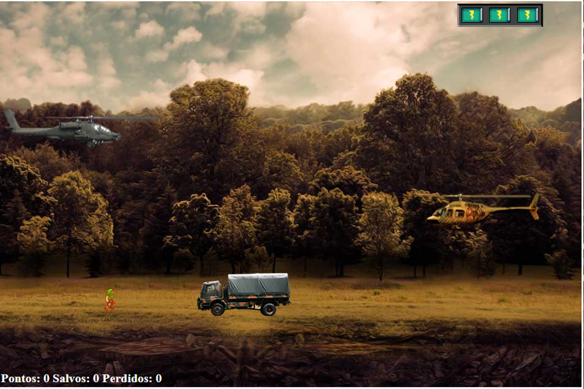

# (DIO) **Construindo o seu primeiro jogo de naves**

Desafio de construir um jogo de naves onde o objetivo é resgatar o prisioneiro (seu amigo) evitando colidir com os inimigos (helicóptero e caminhão) e também evitar que o caminhão inimigo colida com o prisioneiro, aplicando os conceitos de CSS, HTML e JavaScript e utilizando jQuery e jQuery Collisiion.

